# Mission Flow Diagram

## State Machine (Mermaid)

```mermaid
stateDiagram-v2
    [*] --> IDLE
    IDLE --> SEARCH_VEHICLE : use_dynamic_detection=true

    SEARCH_VEHICLE --> WAIT_VEHICLE_BOX : vehicle(s) detected
    SEARCH_VEHICLE --> TURN_IN_PLACE_SEARCH : timeout, rotations < max
    SEARCH_VEHICLE --> DONE : timeout, max rotations reached

    TURN_IN_PLACE_SEARCH --> SEARCH_VEHICLE : rotation complete

    WAIT_VEHICLE_BOX --> APPROACH_VEHICLE : vehicle confirmed
    WAIT_VEHICLE_BOX --> TURN_IN_PLACE_VEHICLE : timeout, rotations < max
    WAIT_VEHICLE_BOX --> NEXT_VEHICLE : timeout, max rotations

    TURN_IN_PLACE_VEHICLE --> WAIT_VEHICLE_BOX : rotation complete

    APPROACH_VEHICLE --> WAIT_TIRE_BOX : nav arrived

    WAIT_TIRE_BOX --> INSPECT_TIRE : tire confirmed
    WAIT_TIRE_BOX --> TURN_IN_PLACE_TIRE : timeout, rotations < max
    WAIT_TIRE_BOX --> NEXT_VEHICLE : timeout, max rotations

    TURN_IN_PLACE_TIRE --> WAIT_TIRE_BOX : rotation complete

    INSPECT_TIRE --> WAIT_TIRE_BOX : more tires
    INSPECT_TIRE --> NEXT_VEHICLE : 4 tires done

    NEXT_VEHICLE --> WAIT_VEHICLE_BOX : more vehicles
    NEXT_VEHICLE --> DONE : all done

    DONE --> [*]
```



## Data Flow (Simplified)

```
Aurora (depth + RGB) ──► depth_to_registered_pointcloud ──► registered PointCloud2
Aurora (RGB) ──────────► ultralytics_node (YOLO) ─────────► ObjectsSegment
                                    │
                                    ▼
                        segmentation_processor ──────────► BoundingBoxes3d
                                    │
                                    ▼
                        inspection_manager ◄──► Nav2 (navigate_to_pose)
                                    │
                                    ▼
                        photo_capture_service ───────────► saved images
```

## Frame Flow for Navigation Goal

```
BoundingBox (slamware_map) ──► goal pose (slamware_map)
                                    │
                                    ▼ tf_buffer.transform(..., "map")
                              goal pose (map) ──► Nav2
```
