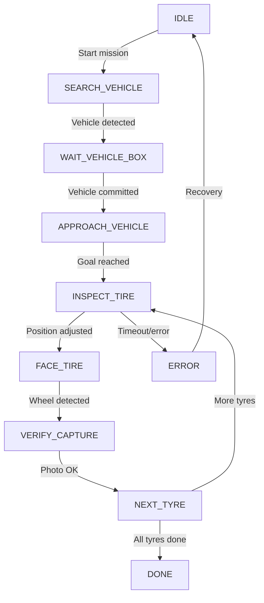

# Mission Flow Diagram

High-level mission flow for the autonomous tyre inspection robot. For the full state machine, see `mission_state_machine.py` and [MISSION_PIPELINE.md](MISSION_PIPELINE.md).

---

## Mission Flow (Simplified)

---

## Notes

- **Tyre order:** Nearest first, then 2nd, 3rd, 4th nearest (Nav2 paths around the vehicle).
- **Per tyre:** INSPECT_TIRE → FACE_TIRE → VERIFY_CAPTURE → NEXT_TYRE (loop until all 4 done).

See [MISSION_PIPELINE.md](MISSION_PIPELINE.md) for phase details and [RUNBOOK.md](../RUNBOOK.md) for operations.
